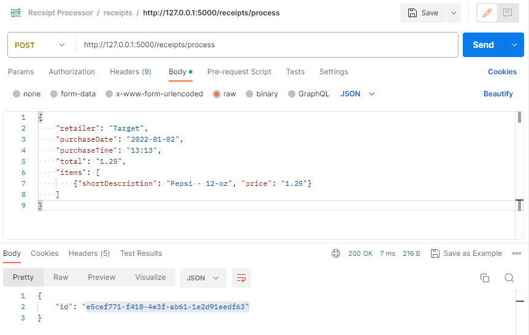
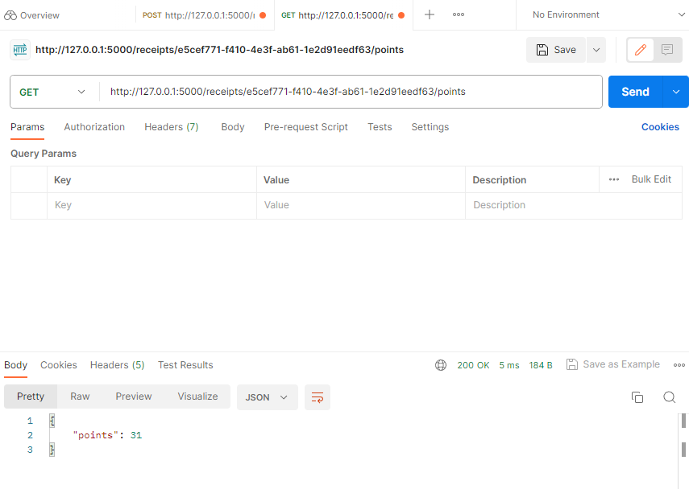

# Fetch Backend Takehome Exercise (Receipt-processor)

Build a webservice that fulfils the documented API. You can find the specific requirements under Receipt-Processor-Instruction.md.

## Local Setup - Without Docker
1. Clone the repository: 

```bash
    git clone https://github.com/ZidongGuo/fetch-backend-takehome.git
```

2. CD to the corresponding file directory:

```bash
    cd fetch-backend-takehome
```

3. Make sure to have pip and python 3.9 or newer version installed. Install the required libraries with the command:

```bash
    pip install -r requirements.txt
```

4. Launch the server at http://127.0.0.1:5000/ by running app.py under the directory or by running command:

```bash
python app.py
```

5. Unit tests are provided in unit_tests.py and you can run the test cases with:
```bash
python unit_tests.py
```

6. You can utilize Postman for mocking GET/POST JSON query to http://127.0.0.1:5000/receipts/process and http://127.0.0.1:5000/receipts/{id}/points where id is id field value in the response from endpoint /receipts/process. 

